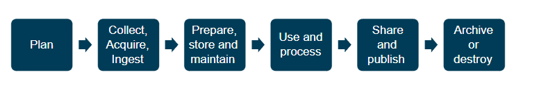
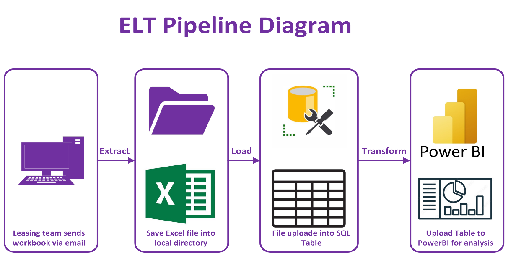

# Impact Evaluation

## Executive Summary

BT Group has the majority share of the telecommunication industry in the UK, and a number of products like broadband, mobile and landline (Wikipedia Contributors, 2019). A smaller part of the business offers companies the opportunity to lease equipment (BT Group, 2016).  There are multiple benefits to leasing equipment such as spreading the cost of a selected term, reducing taxable profits and tailoring the lease to the company’s budget. 

The department which manages the leases uses Excel workbooks to update and create new leases. Which are then uploaded manually into PowerBI for reporting. This, creates issues for multiple departments within the organisation such as Financial analysts, C-suite (Indeed, 2024) and Sales managers. As they want the figures and graphs delivered on time and accurate.

As the organisation Is undergoing a digital transformation the leasing team have requested an End to End pipeline which Extracts, Loads and Transforms (Dave, 2020) the data into a PowerBI dashboard. The benefits of which can provide better data integrity, faster ingestion and an interactive dashboard which the wider organisation can access.

Within the organisation we already have a SQL server which can send the data directly into PowerBI. This is a great cost-effective solution to upload the data and perform the data checks before applying the transformation on PowerBI. The dashboard will also need to have custom settings to only allow granted users access, no web publishing and hide certain columns which contain sensitive data (Government of UK, 2018). Furthermore, as the dashboard caters a wide user base which can support technical and non-technical users. While also conforming to BT group colour and visual themes.

## Data Infrastructure & Tools

Ordinarily ETL (Extract, Transform, Load) (Wiki, 2020) is the most common data ingestion process used as it can help with reducing data warehouses. This in return helps the organisation to reduce costs with bandwidth and storage. I have opted for ELT (Extract, Load, Transform) as it is the most used process within BT and I have to adhere with the guidelines set. In addition, it allows for more options for the end user as the data set can be manipulated based on the end user requirements (AWS, 2022). 

SQL Server Management Studio Is used to load the load the workbook into a table. First of all, this is so that the columns and data types are all matching. Secondly so that I can create a procedure which to perform all the data integrity checks. Plus, I can wrap all of this within a job which can be scheduled to run at a set time or trigger when the file arrives.

PowerBI is selected, as its also a Microsoft product which makes connecting to a SQL server very easy. Furthermore, it offers a wide range of graphs and charts to create interactive dashboards. While also, offering the security capabilities to protect the data and only allowing authorised users. 

As all 3 parts Excel, SSMS & PowerBI are Microsoft tools this adds to the robustness of the design. I have also reviewed similar projects within the organisation that have used all 3 to great success. Alongside reviewing online material which has shown the effectiveness of the Microsoft tools in an ELT pipeline (Bushong, 2024). 
