# Impact Evaluation

## Executive Summary

BT Group has the majority share of the telecommunication industry in the UK, and a number of products like broadband, mobile and landline (Wikipedia Contributors, 2019). A smaller part of the business offers companies the opportunity to lease equipment (BT Group, 2016).  There are multiple benefits to leasing equipment such as spreading the cost of a selected term, reducing taxable profits and tailoring the lease to the company’s budget. 

The department which manages the leases uses Excel workbooks to update and create new leases. Which are then uploaded manually into PowerBI for reporting. This, creates issues for multiple departments within the organisation such as Financial analysts, C-suite (Indeed, 2024) and Sales managers. As they want the figures and graphs delivered on time and accurate.

As the organisation Is undergoing a digital transformation the leasing team have requested an End to End pipeline which Extracts, Loads and Transforms (Dave, 2020) the data into a PowerBI dashboard. The benefits of which can provide better data integrity, faster ingestion and an interactive dashboard which the wider organisation can access.

Within the organisation we already have a SQL server which can send the data directly into PowerBI. This is a great cost-effective solution to upload the data and perform the data checks before applying the transformation on PowerBI. The dashboard will also need to have custom settings to only allow granted users access, no web publishing and hide certain columns which contain sensitive data (Government of UK, 2018). Furthermore, as the dashboard caters a wide user base which can support technical and non-technical users. While also conforming to BT group colour and visual themes.

## Data Infrastructure & Tools

Ordinarily ETL (Extract, Transform, Load) (Wiki, 2020) is the most common data ingestion process used as it can help with reducing data warehouses. This in return helps the organisation to reduce costs with bandwidth and storage. I have opted for ELT (Extract, Load, Transform) as it is the most used process within BT and I have to adhere with the guidelines set. In addition, it allows for more options for the end user as the data set can be manipulated based on the end user requirements (AWS, 2022). 

SQL Server Management Studio Is used to load the load the workbook into a table. First of all, this is so that the columns and data types are all matching. Secondly so that I can create a procedure which to perform all the data integrity checks. Plus, I can wrap all of this within a job which can be scheduled to run at a set time or trigger when the file arrives.

PowerBI is selected, as its also a Microsoft product which makes connecting to a SQL server very easy. Furthermore, it offers a wide range of graphs and charts to create interactive dashboards. While also, offering the security capabilities to protect the data and only allowing authorised users. 

As all 3 parts Excel, SSMS & PowerBI are Microsoft tools this adds to the robustness of the design. I have also reviewed similar projects within the organisation that have used all 3 to great success. Alongside reviewing online material which has shown the effectiveness of the Microsoft tools in an ELT pipeline (Bushong, 2024). 

## Data Engineering

Extracted workbook sent via mail, data has been anonymized not only to meet GDPR but also to meet BT group internal guidelines regarding security and compliance. 

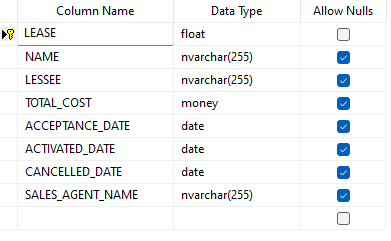

SQL table created with primary key constraint (Bisso, 2020) on the “LEASE” column as the values entered should be unique. As duplicated values within the dataset can have external factors such as reporting to HMRC and shareholders.

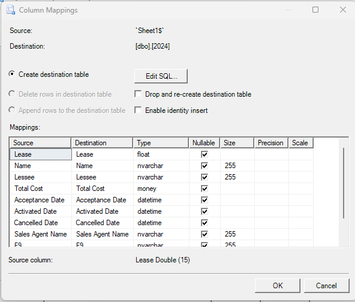

Uploading the workbook into a SQL table, here I made sure to check the columns were mapped correctly. Also, to check the datatypes before ingestion, as having the incorrect datatypes can lead to corruption or loss of data.

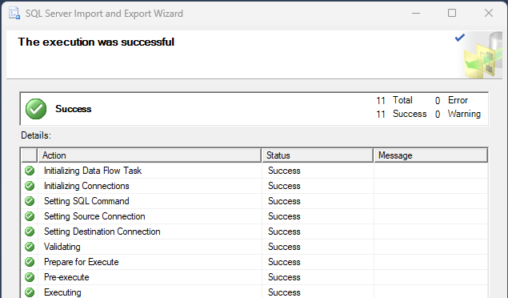

Workbook successfully uploaded without any errors.

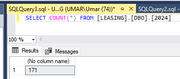

To confirm this, I have run a simple COUNT function which will display the number of rows within a given table. I now crosschecked this with the workbook to confirm all rows were uploaded.

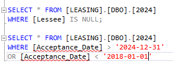

Here I have run 2 different procedures the first one of which, is to check for NULL values within the “LESSEE” column. The second procedure checks to make sure there are no date values before 2018 and after 2024. This is all part of the data integrity checks so that the analytical results are not affected. As an example, having a single incorrect date value could affect a Sales members bonus for that month (Elahi, 2022).

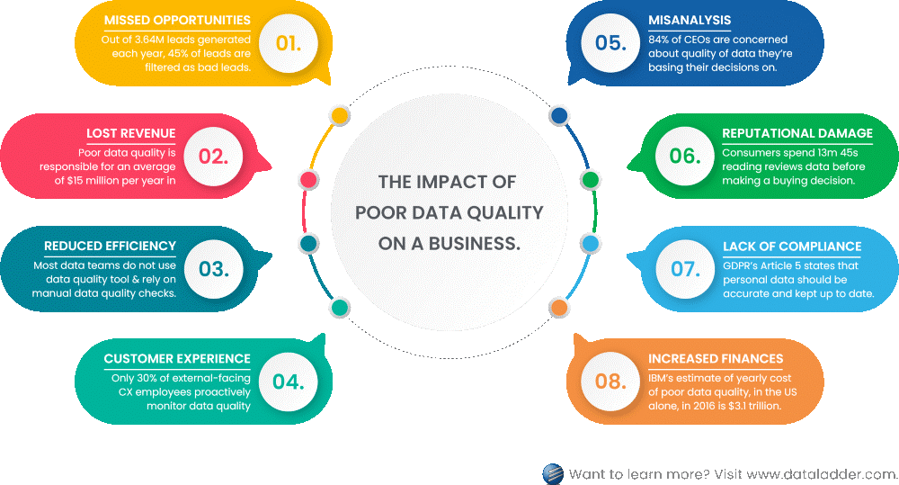

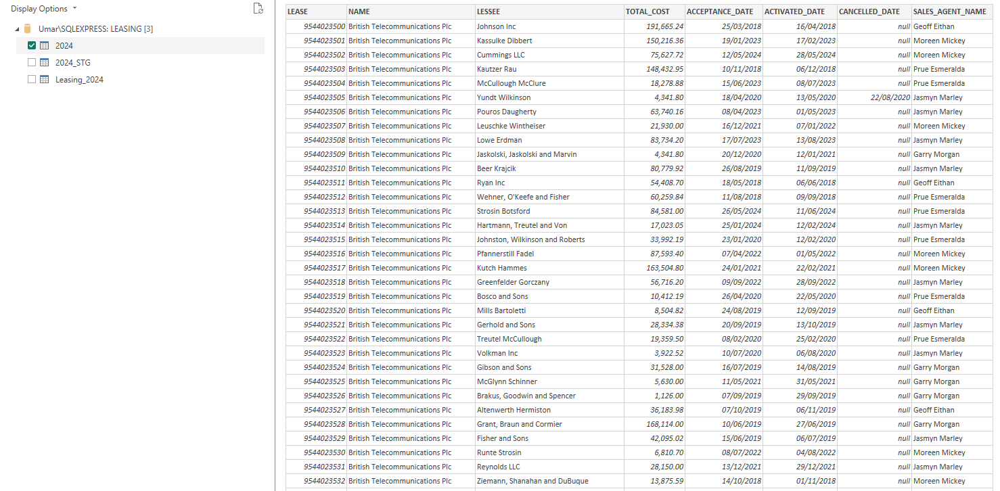

As all the data checks are complete, I have connected the PowerBI dashboard to the SQL server. Using my credentials for verification so that no one else can use the data. All the columns look good and data was uploaded without any issues.

## Data Visualisation & Dashboards

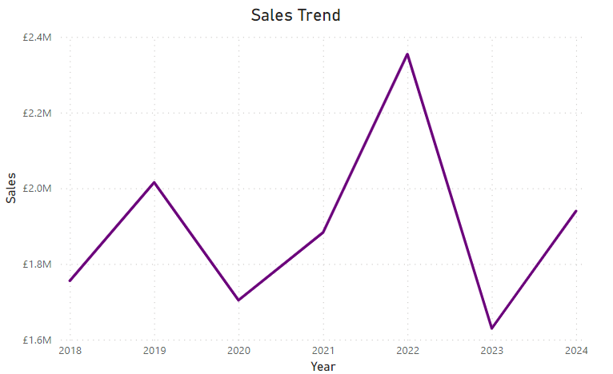

Line graph to show performance over the years to check for trends. This also shows the historical performance for the leasing department. Hovering over a point can give the end user a more accurate figure. Which is great for financial analysts who want compare the performance to other departments. 

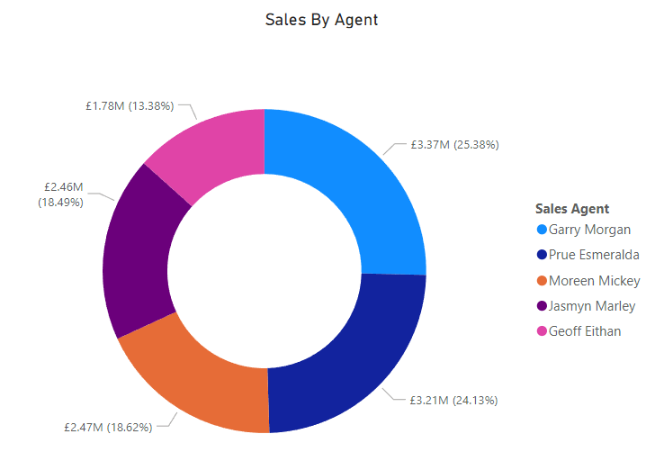

Donut chart split by Sales agents to show the best performing sales agents. This is great for sales managers as it provides a clear overview of all the agents and who’s performing the best.

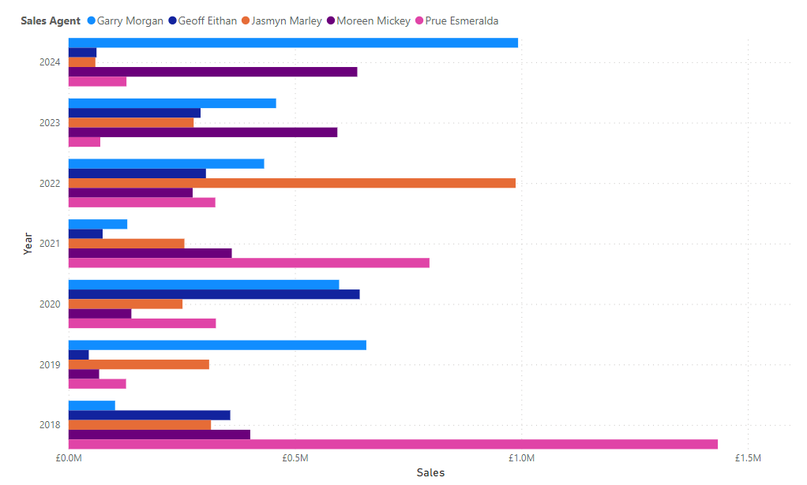

Clustered bar chart is great for showing a lot of technical information within a single graph. Sales agents figures split by year to give a more detailed view for each individual.

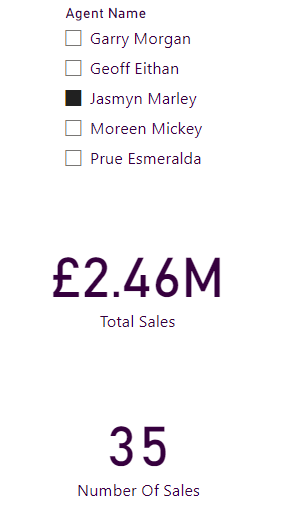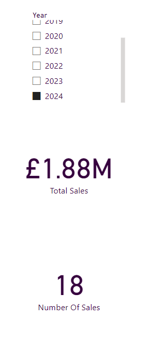

Face cards show information in an easy to read format, and interactive filters for more technical users requiring specific answers. Perfect for C-Suite who will want the information quick with minimal interaction.

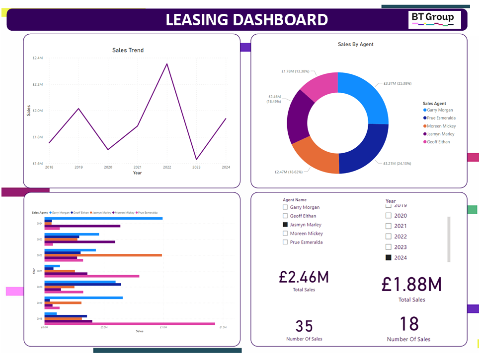

Final Dashboard which conforms to BT group schemes and supports both technical and non-technical users (Subotin, 2022). The dashboard can only be viewed by granted users and does not display any customer data. Furthermore as its created within the organisation it can only be viewed by BT employees. 

## Conclusion

The executed process shows an End to End ELT pipeline from Excel workbook, to a complete interactive PowerBI Dashboard. With data quality and integrity checks along the way to ensure the project meets BT and GDPR rules. The use of the Microsoft ecosystem delivered a flawless pipeline which Extracted, Loaded and Transformed the Data with faster ingestion and better accuracy. All while being cost effective and utilising existing licenses within the organisation. The existing knowledge around similar processes helped deliver this project within a timely manner.

Having delivered the project, the benefits to the company are widespread. Firstly, as the pipeline incorporates all the tasks which would normally be done manually in a semi-automated process. The time saved for the company can be utilised elsewhere. In addition, as the checks are done by procedures this eliminates manual data validation.

The dashboard shows the performance of the Leasing department over time. Which previously was not as easily accessible to financial analysts who can now make real time decisions with performance figures. This allows the company to react quicker to market changes. Sales managers can view performance of their employees and reward with accurate bonuses. Executive level managers have the ability to view condensed information while also the ability to interact for more detailed information.
The primary goal was to help the leasing department conform the digital transformation being undertaken at the organisation. The pipeline helps not only to reduce the time taken to produce reports but all while providing more accurate data, encompassed in a robust pipeline. 

To improve the pipeline, I would firstly set up an email server which is connected to the SQL server. This would allow the Leasing department to send the workbook directly in a secure system. Secondly to fully automate the pipeline I would create a SQL server job and assign a schedule. This would mean no manual inputs would be required once the workbook was sent. Thus, saving the company man hours alongside removing human input (austinnoronha, 2023).
Another refinement which would help the robustness of the pipeline is to create a staging table so that if any data errors are detected it doesn’t affect the final dashboard. And to help with testing I would recommend one of my colleagues reviews the pipeline to ensure no steps have been missed. 

The advancements would not only improve the dashboard from a technical overview, but also add to the robustness of the design. So that the organisation can continue to improve operational efficiency and informed decision making.

## References

austinnoronha 2023. Automated vs Manual vs Semi-Automated Deployments. BuzzingCode - Learn, Adapt & Code. [Online]. [Accessed 28 August 2024]. Available from: https://buzzingcode.com/cloud-architecture/the-best-deployment-strategy-automated-vs-manual-vs-semi-automated/.

AWS 2022. ETL vs ELT - Difference Between Data-Processing Approaches - AWS. Amazon Web Services, Inc. [Online]. Available from: https://aws.amazon.com/compare/the-difference-between-etl-and-elt/#:~:text=data%20regulation%20requirements.-.

Bisso, I.L. 2020. What is a Primary Key in SQL? LearnSQL.com. [Online]. Available from: https://learnsql.com/blog/primary-key-sql/.BT Group 2016. 

Finance and leasing options for IT kit. BT Business Direct. [Online]. Available from: https://www.businessdirect.bt.com/our-services/leasing/#:~:text=Leasing%3A%20How%20BT%20can%20help%20you%3A&text=Funding%20is%20arranged%20by%20our.Bushong, 

M. 2024. Mastering Enterprise T-SQL ETL/ELT: A Guide with Data Warehouse and Fabric Pipelines | Microsoft Fabric Blog | Microsoft Fabric. Microsoft.com. [Online]. Available from: https://blog.fabric.microsoft.com/en-us/blog/mastering-enterprise-t-sql-etl-elt-a-guide-with-data-warehouse-and-fabric-pipelines?ft=All.Dave 2020. 

Extract. Wikipedia. [Online]. Available from: https://en.wikipedia.org/wiki/Extract.

Elahi, E. 2022. The impact of poor data quality: Risks, challenges, and solutions. Data Ladder. [Online]. Available from: https://dataladder.com/the-impact-of-poor-data-quality-risks-challenges-and-solutions/.

Government of UK 2018. Data Protection Act. GOV.UK. [Online]. Available from: https://www.gov.uk/data-protection.Indeed 2024. What Is the C-Suite? 

Indeed. [Online]. Available from: https://www.indeed.com/career-advice/career-development/c-suite.Subotin, 

S. 2022. Dashboard Design - Considerations and Best Practices. Toptal Design Blog. [Online]. Available from: https://www.toptal.com/designers/data-visualization/dashboard-design-best-practices#:~:text=User%20research%20is%20important%20because.

Wiki 2020. Extract. Wikipedia. [Online]. Available from: https://en.wikipedia.org/wiki/Extract.Wikipedia Contributors 2019. BT Group. Wikipedia. [Online]. Available from: https://en.wikipedia.org/wiki/BT_Group.
